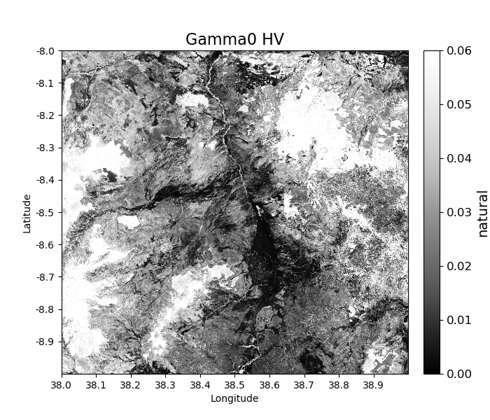
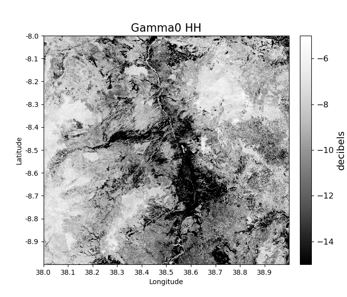
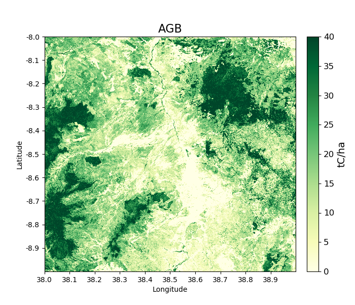
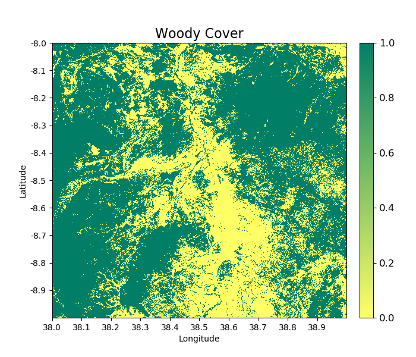
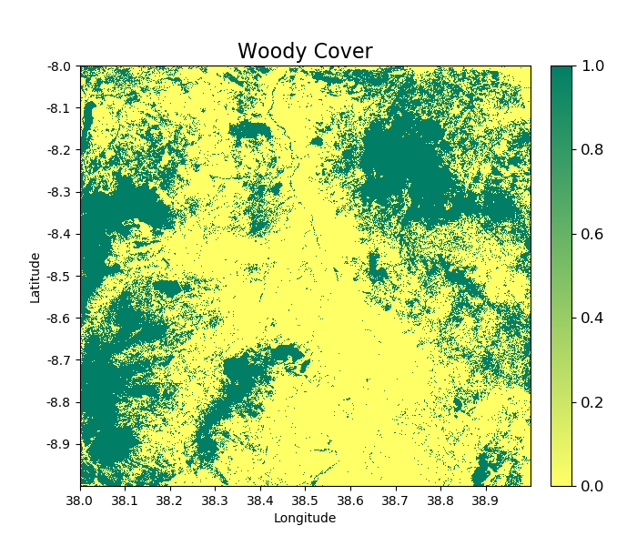
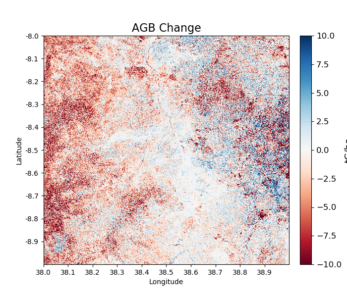
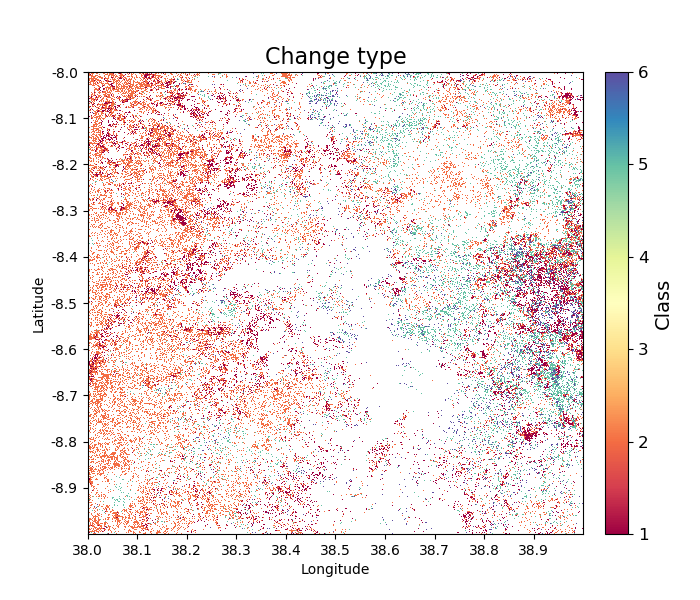
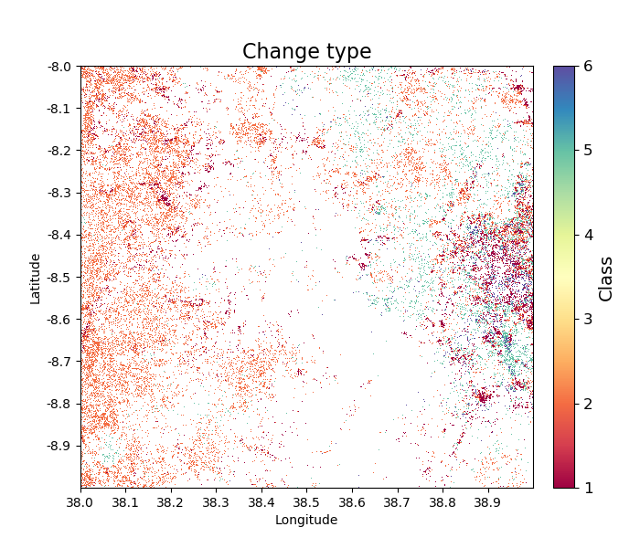
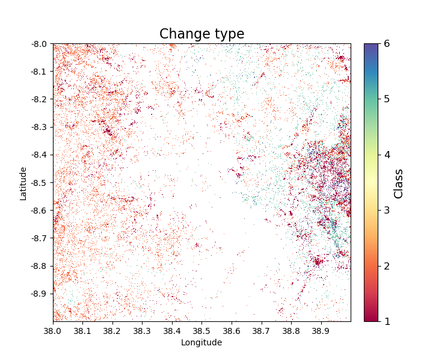

Command line tools
==================

``biota`` was initially developed as a tool for use in Python. However, command line functionalities are available to download data and produce outputs of:

* Calibrated gamma0 backscatter
* Forest cover
* Aboveground biomass
* Aboveground biomass change
* Classified forest change types (i.e. deforestation, degradation etc.)

These are available through the command line tool ``biota``.

Getting ALOS mosaic data
------------------------

Data from the ALOS mosaic product can be accessed from JAXA through a graphical interface `online`_ after `signing up`_. The data is delivered in either 1x1 degree tiles or 5x5 degree collections of tiles (recommended).

.. _online: http://www.eorc.jaxa.jp/ALOS/en/palsar_fnf/data/index.htm
.. _signing up: http://www.eorc.jaxa.jp/ALOS/en/palsar_fnf/registration.htm

To obtain national-scale data using the web interface is possible, but for large-scale applications ``biota`` contains a command line interface to automate the download and decompression process. ``download.py`` takes latitude, longitude and years as inputs, and returns a downloaded an decompressed and ready-to-use product in a format the ``biota`` will understand.

The ``biota`` tool includes a script to download ALOS mosaic tiles directly from the JAXA FTP server. The user specifies either a 1x1 or 5x5 degree tile by its upper-left corner latitude and longitude and a year or set of years. The downloader handles access of both the older ALOS-1 filename structure and the ALOS-2 filename structure. The script also optionally decompress images after download.

Help for ``download.py`` can be viewed by typing ``biota download --help``:

.. code-block:: console

    usage: download.py [-h] [-lat DEG] [-lon DEG] [-l] [-y Y [Y ...]] [-o DIR]
                    [-r]

    Download ALOS-1/2 data from JAXA, specifying a particular year and
    latitude/longitude.

    Required arguments:
    -lat DEG, --latitude DEG
                            Latitude of tile upper-left corner.
    -lon DEG, --longitude DEG
                            Longitude of tile upper-left corner.

    Optional arguments:
    -l, --large           Download large tiles. ALOS mosaic tiles are available
                            in 1x1 or 5x5 degree tiles. If downloading large
                            volumes of data, it's usually better to use the
                            latter. If this option is chosen, you must select a
                            lat and lon that's a multiple of 5 degrees.
    -y Y [Y ...], --years Y [Y ...]
                            Year of data to download. Defaults to downloading all
                            data.
    -o DIR, --output_dir DIR
                            Optionally specify an output directory. Defaults to
                            the present working directory.
    -r, --remove          Optionally remove downloaded .tar.gz files after
                            decompression.

For example, to download data for the 1x1 tile at 38 degrees longitude and -8 degrees latitude for the years 2007 and 2010, input:

.. code-block:: console

    biota download -lon 38 -lat -8 -y 2007 2010

To download all tiles for the 5x5 degree area (recommended) covering 35 - 40 degrees longitude and -5 - -10 degrees latitude for the years 2007 and 2010, input:

.. code-block:: console

    biota download -lon 35 -lat -5 --large -y 2007 2010

To specify an output directory, we can use the ``-o`` option:

.. code-block:: console

    biota download -lon 38 -lat -8 -y 2007 2010 -o /path/to/output_dir

ALOS mosaic data are delivered as compressed files, which ``biota`` will decompress. To remove the original files after decompression, use the ``-r`` flag:

.. code-block:: console

    biota download -lon 38 -lat -8 -y 2007 2010 -r

Mapping vegetation properties
-----------------------------

The ``biota`` tool features a command line option to produce a raster of vegetation properties for a given year. The user specifies the directory where the data are stored, then specifies the designated location and year like for the ``download``. The user may choose to produce rasters for any or all of the following properties: Gamma0, Aboveground Biomass, Woody Cover. Filtering, downsampling and options specific to each property are available.

Help for this functionality can be viewed by typing ``biota property --help`` or ``biota property -h``:

.. code-block:: console
    
	usage: property.py [-h] [-dir DIR] [-lat DEG] [-lon DEG] [-y Y [Y ...]]
					   [-o {Gamma0,AGB,WoodyCover,all}] [-nf] [-ds N] [-od DIR]
					   [-v] [-p POL] [-u units] [-ft tC/ha] [-at ha]

	Process ALOS-1/2 mosaic data to prpoduce estimates of forest cover and
	biomass.

	Required arguments:
	  -dir DIR, --data_directory DIR
							Path to directory containing ALOS mosaic data.
	  -lat DEG, --latitude DEG
							Latitude of tile to process (upper-left corner).
	  -lon DEG, --longitude DEG
							Longitude of tile to process (upper-left corner).
	  -y Y [Y ...], --years Y [Y ...]
							Years of data to process.

	Optional arguments:
	  -o {Gamma0,AGB,WoodyCover,all}, --output {Gamma0,AGB,WoodyCover,all}
							Choose which kind of output you want. Defaults to all
							possible outputs.
	  -nf, --nofilter       Use this flag if you don't want to apply a speckle
							filter.
	  -ds N, --downsample_factor N
							Apply downsampling to inputs by specifying an integer
							factor to downsample by. Defaults to no downsampling.
	  -od DIR, --output_dir DIR
							Optionally specify an output directory. Defaults to
							the present working directory.
	  -v, --verbose         Print progress to terminal. Defaults to False.

	Output-specific arguments:
	  -p POL, --polarisation POL
							If you have selected Gamma0 as an output, choose the
							polarisation. Defaults to HV.
	  -u units, --units units
							If you have selected Gamma0 as an output, choose the
							outputs units. Defaults to 'natural' units.
	  -ft tC/ha, --forest_threshold tC/ha
							If you have selected WoodyCover as an output, choose
							the miminum forest biomass threshold. Defaults to 10
							tC/ha.
	  -at ha, --area_threshold ha
							If you have selected WoodyCover as an output, choose
							the minimum forest area threshold. Defaults to 0 ha.

		usage: property.py [-h] [-dir DIR] [-lat DEG] [-lon DEG] [-y Y [Y ...]]
							   [-o {Gamma0,AGB,WoodyCover,all}] [-lf] [-ds FACTOR]
							   [-od DIR] [-pz {HV,HH,VH,VV}] [-ft THRESHOLD]
							   [-at THRESHOLD]

Gamma0 backscatter
~~~~~~~~~~~~~~~~~~

For example, to produce a calibrated image of Gamma0 backscatter for the HV polarisation for the downloaded 1x1 tile at 38 degrees longitude and -8 degrees latitude for the year 2007, run:

.. code-block:: console
    
    biota property -dir /path/to/data/ -lon 38 -lat -8 -y 2007 -o Gamma0

To produce the same image, but using the HH polarisation and with units of decibels:

.. code-block:: console
    
    biota property -dir /path/to/data/ -lon 38 -lat -8 -y 2007 -o Gamma0 -u decibels -p HH

If you prefer not to apply a speckle filter:

.. code-block:: console
    
    biota property -dir /path/to/data/ -lon 38 -lat -8 -y 2007 -o Gamma0 --nofilter

Aboveground biomass
~~~~~~~~~~~~~~~~~~~

To produce a map of aboveground biomass (based on a generic southern African biomass-backscatter model, in units of tC/ha) for the same tile run:

.. code-block:: console

    biota property -dir /path/to/data/ -lon 38 -lat -8 -y 2007 -o AGB

Woody cover
~~~~~~~~~~~

``biota`` can also be used to produce a map of forest cover (or woody cover), based on a threshold of biomass. By default the 10 tC/ha threshold separates forest from nonforest.

To produce a map of woody cover run:

.. code-block:: console

    biota property -dir /path/to/data/ -lon 38 -lat -8 -y 2007 -o WoodyCover

To use a custom forest/non-forest threshold (e.g. 20 tC/ha), use the ``-ft`` option:

.. code-block:: console

    biota property -dir /path/to/data/ -lon 38 -lat -8 -y 2007 -o WoodyCover -ft 20

Forest definitions often contain a minimum area threshold (e.g. a forest patch must be greater than 1 ha in size) to be counted as forest. To also add a minimum area threshold with ``biota`` use the ``-at`` option:

.. code-block:: console

    biota property -dir /path/to/data/ -lon 38 -lat -8 -y 2007 -o WoodyCover -ft 20 -at 1

Producing vegetation change rasters
-----------------------------------

The ``biota`` tool features a command line option to produce a raster of vegetation change between two given years. The user specifies the directory where the data are stored, then specifies the designated location and two years to compare.

Help for this functionality can be viewed by typing ``biota change --help`` or ``biota change -h``:

.. code-block:: console

	usage: change.py [-h] [-dir DIR] [-lat DEG] [-lon DEG] [-y1 YR] [-y2 YR]
					 [-o {AGBChange,ChangeType,all}] [-nf] [-ds N] [-od DIR] [-v]
					 [-ct ha] [-mt tC/ha] [-it PC] [-ft tC/ha] [-at ha]

	Process ALOS-1/2 moasic data to output biomass and woody cover change between
	2 years.

	Required arguments:
	  -dir DIR, --data_directory DIR
							Path to directory containing ALOS mosaic data.
	  -lat DEG, --latitude DEG
							Latitude of tile to process (upper-left corner).
	  -lon DEG, --longitude DEG
							Longitude of tile to process (upper-left corner).
	  -y1 YR, --year1 YR    First year of data to process.
	  -y2 YR, --year2 YR    Second year of data to process.

	Optional arguments:
	  -o {AGBChange,ChangeType,all}, --output {AGBChange,ChangeType,all}
							Choose which kind of output you want. Defaults to all
							possible outputs.
	  -nf, --nofilter       Use this flag if you don't want to apply a speckle
							filter.
	  -ds N, --downsample_factor N
							Apply downsampling to inputs by specifying an integer
							factor to downsample by. Defaults to no downsampling.
	  -od DIR, --output_dir DIR
							Optionally specify an output directory. Defaults to
							the present working directory.
	  -v, --verbose         Print progress to terminal. Defaults to False.

	Output-specific arguments:
	  -ct ha, --change_area_threshold ha
							If you have selected ChangeType as an output, choose a
							threshold for a minimum change in forest area required
							to be flagged as a change. Defaults to 0 ha.
	  -mt tC/ha, --change_magnitude_threshold tC/ha
							If you have selected ChangeType as an output, choose
							the minimum absolute change in biomass to be flagged
							as a change. Defaults to 0 tC/ha.
	  -it PC, --change_intensity_threshold PC
							If you have selected ChangeType as an output, choose
							the minimum relative change in biomass to be flagged
							as a change. Defaults to 0 percent.
	  -ft tC/ha, --forest_threshold tC/ha
							If you have selected ChangeType as an output, choose
							the miminum forest biomass threshold in each input
							image. Defaults to 10 tC/ha.
	  -at ha, --area_threshold ha
							If you have selected ChangeType as an output, choose
							the minimum forest area threshold in each input image.
							Defaults to 0 ha.

AGB Change
~~~~~~~~~~

``biota`` can produce estimates of AGB change 

To produce a map of biomass change for the downloaded 1x1 tile at 38 degrees longitude and -8 degrees latitude between 2007 and 2010, run:

.. code-block:: console

    biota change -dir /path/to/data/ -lon 38 -lat -8 -y1 2007 -y2 2010 -o AGBChange

Change detection
~~~~~~~~~~~~~~~~

Changes in AGB are classified based on a series of thresholds:

+--------------------------------+---------------------------------------------------------------------------+
| **Threshold**                  | **Description**                                                           |
+--------------------------------+---------------------------------------------------------------------------+
| ``forest_threshold``           | The minimum AGB that defines a forest area (tC/ha).                       |
+--------------------------------+---------------------------------------------------------------------------+
| ``change_area_threshold``      | The minimum area over which a change must occurr (ha).                    |
+--------------------------------+---------------------------------------------------------------------------+
| ``change_magnitude_threshold`` | The minimum absolute change of AGB that defines a change event (tC/ha).   |
+--------------------------------+---------------------------------------------------------------------------+
| ``change_intensity_threshold`` | The minimum proportional change of AGB that defines a change event (0-1). |
+--------------------------------+---------------------------------------------------------------------------+

There are 7 change types described in ``biota``, each of which is defined as a number 0 to 6 in the output GeoTiff. Change types are:

+-------------------+-----------------+-------------------------------------------------------------------------------------------------------------------------------------+
| **Change class**  | **Pixel value** | **Description**                                                                                                                     |
+-------------------+-----------------+-------------------------------------------------------------------------------------------------------------------------------------+
| Deforestation     | 1               | A loss of AGB from that crosses the ``forest_threshold``.                                                                           |
+-------------------+-----------------+-------------------------------------------------------------------------------------------------------------------------------------+
| Degradation       | 2               | A loss of AGB in a location above the ``forest_threshold`` in both images.                                                          |
+-------------------+-----------------+-------------------------------------------------------------------------------------------------------------------------------------+
| Minor Loss        | 3               | A loss of AGB that does not cross the ``change_area_threshold``, ``change_magnitude_threshold``, or ``change_intensity_threshold``. |
+-------------------+-----------------+-------------------------------------------------------------------------------------------------------------------------------------+
| Minor Gain        | 4               | A gain of AGB that does not cross the ``change_area_threshold``, ``change_magnitude_threshold``, or ``change_intensity_threshold``. |
+-------------------+-----------------+-------------------------------------------------------------------------------------------------------------------------------------+
| Growth            | 5               | A gain of AGB in a location above the ``forest_threshold`` in both images.                                                          |
+-------------------+-----------------+-------------------------------------------------------------------------------------------------------------------------------------+
| Aforestation      | 6               | A gain of AGB that crosses the ``forest_threshold``.                                                                                |
+-------------------+-----------------+-------------------------------------------------------------------------------------------------------------------------------------+
| Nonforest         | 0               | Below ``forest_threshold`` in both images.                                                                                          |
+-------------------+-----------------+-------------------------------------------------------------------------------------------------------------------------------------+

To identify change types with default parameters, use:

.. code-block:: console
    
    biota change -dir /path/to/data/ -lon 38 -lat -8 -y1 2007 -y2 2010 -o ChangeType

To apply a minimum area of 1 hectare for a given change:

.. code-block:: console
    
    biota change -dir /path/to/data/ -lon 38 -lat -8 -y1 2007 -y2 2010 -o ChangeType -ct 1

To also apply a minimum absolute change threshod of 5 tC/ha:

.. code-block:: console
    
    biota change -dir /path/to/data/ -lon 38 -lat -8 -y1 2007 -y2 2010 -o ChangeType -ct 1 -mt 5

To also apply a minumum relative change threshold of 25 % of biomass change:

.. code-block:: console
    
    biota change -dir /path/to/data/ -lon 38 -lat -8 -y1 2007 -y2 2010 -o ChangeType -ct 1 -mt 5 -it 25

.. image:: images/cmd_12.png
      :width: 400
      :align: center

Change detection recipes
~~~~~~~~~~~~~~~~~~~~~~~~

To produce high-quality estimates of change, the user will need to carefully define the multiple parameters determing change parameters based on experimentation and ecological knowledge. Some recipes that have worked well for us include the following.

For production of deforestation estimates in Zimbabwe:

.. code-block:: console
    
    biota change -dir /path/to/data/ -lon 38 -lat -8 -y1 2007 -y2 2010 -o ChangeType -ct 1 -it 25

More recipes to follow after the Nairobi SMFM workshop (11th - 15th March 2019).
