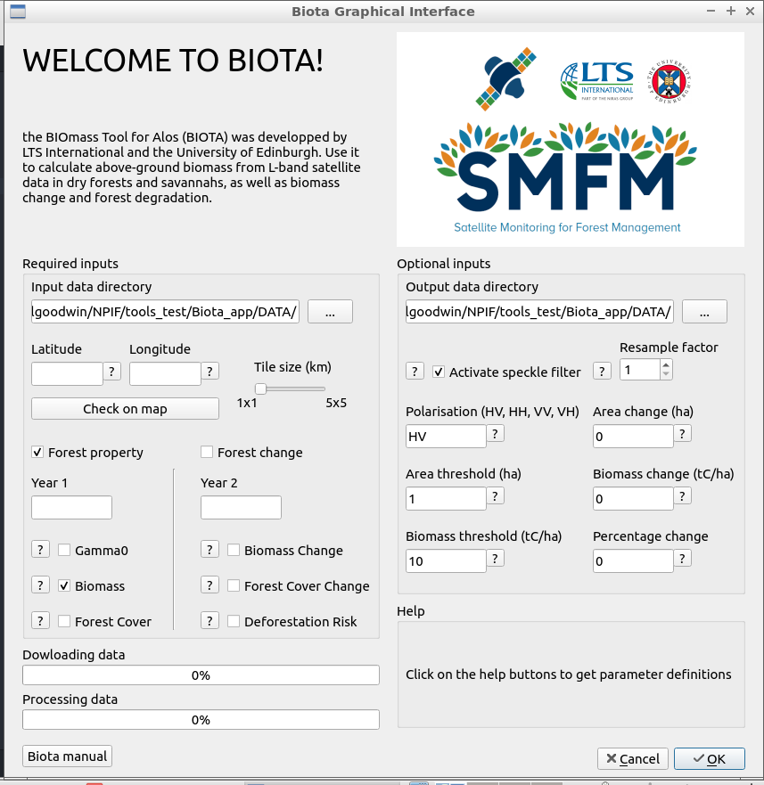

Graphical User Interface
========================

In this section, we describe the features of the `biota` GUI. Use this form of `biota` if you are not comfortable with terminals or scripting, or if you simply want to process a single tile easily.

The biota window
----------------

The `biota` GUI has three panels: Primary inputs, Secondary inputs, and Help. By clicking on the interrogation buttons, you will display offline help for a given parameter.

Primary inputs
---------------

Primary inputs are those that need your attention. You NEED to select an input data directory (even if there is a default), and you NEED to specify the top-left latitude and longitude for the tile you will process. You also NEED to enter at least the Year 1 parameter. If something goes wrong, an error message will appear.

Secondary inputs
----------------

Secondary does not mean they are not important! Parameters in this panel are filled with default values, but if you delete them you will get an error message. See the individial help message to decide which value to attribute to each parameter.
