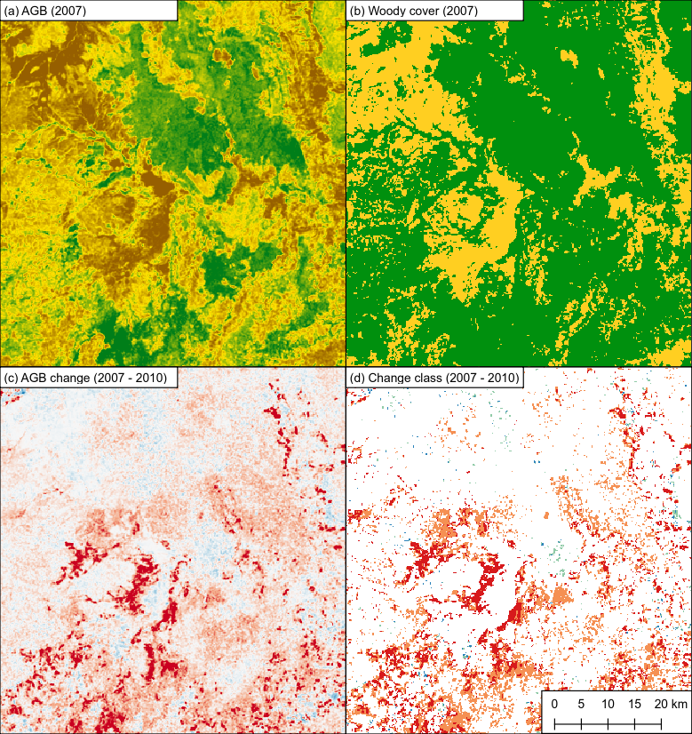

.. biota documentation master file, created by
   sphinx-quickstart on Tue Jan 16 17:17:01 2018.
   You can adapt this file completely to your liking, but it should at least
   contain the root `toctree` directive.

Documentation for SMFM biota
============================

The BIOmass Tool for Alos (``biota``) is a Python library that uses data from JAXA's ALOS mosaic product to generate maps of:

* Aboveground biomass
* Forest cover
* Forest cover change

Who do I talk to?
-----------------

Written and maintained by Samuel Bowers (sam.bowers@ed.ac.uk).

Contents:
=========

.. toctree::
   :maxdepth: 1

   setup.rst
   usage.rst
   command_line.rst
   gui.rst
   worked_example_1.rst
   worked_example_2.rst
   worked_example_3.rst
   biota.rst

Indices and tables
==================

* :ref:`genindex`
* :ref:`modindex`
* :ref:`search`
