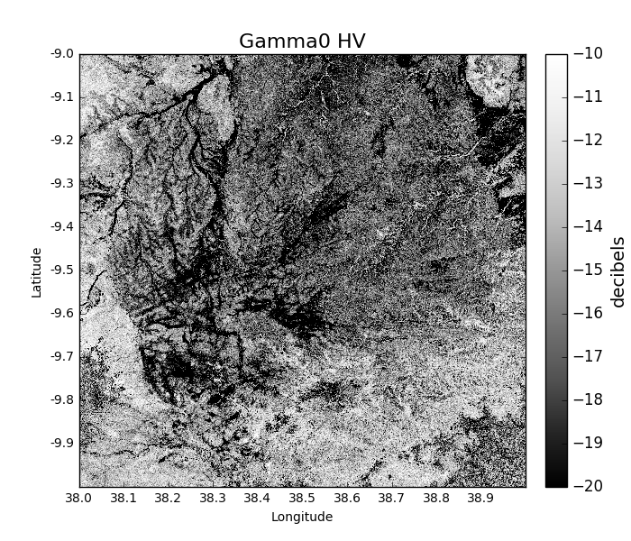
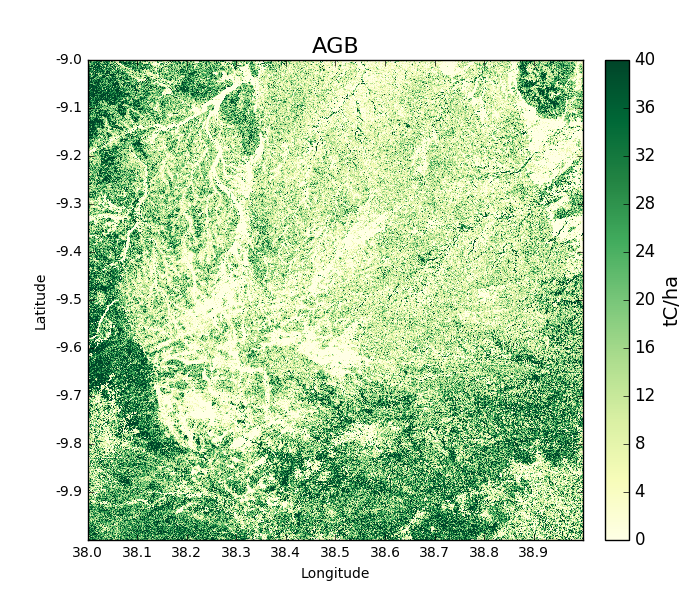
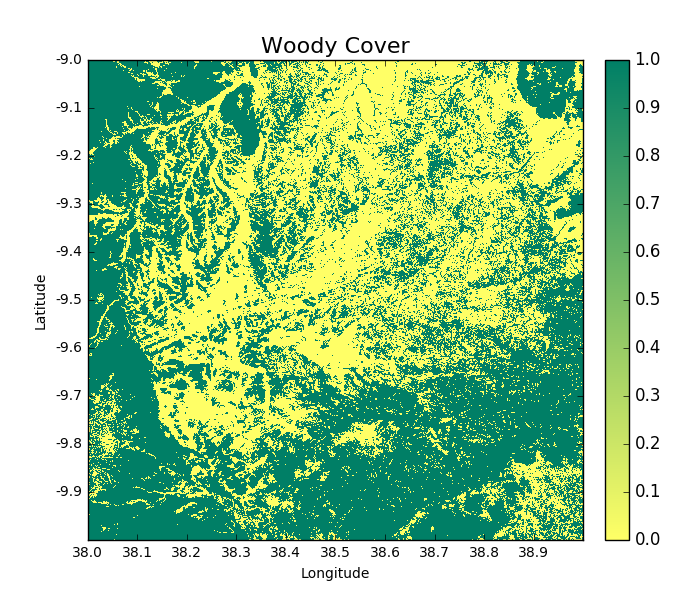
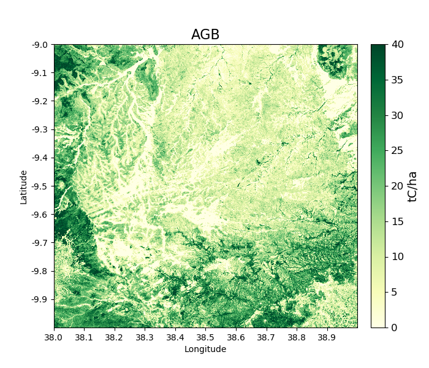
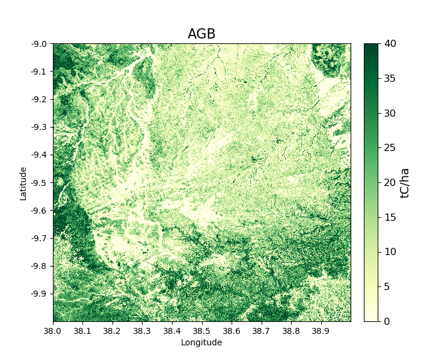
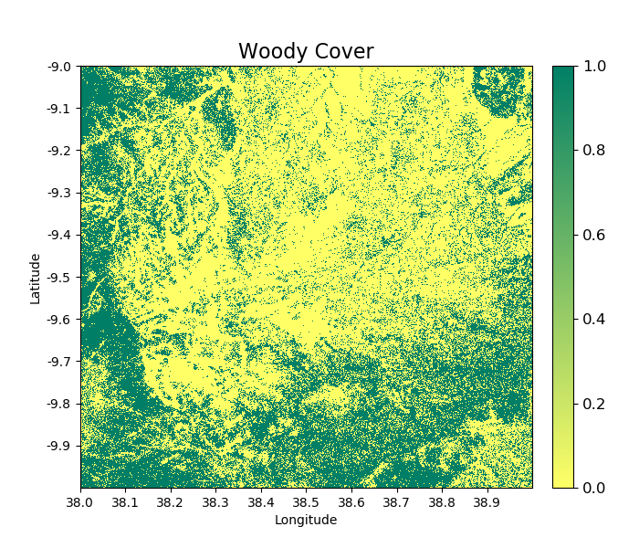
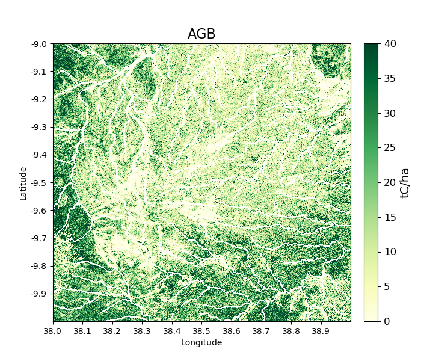
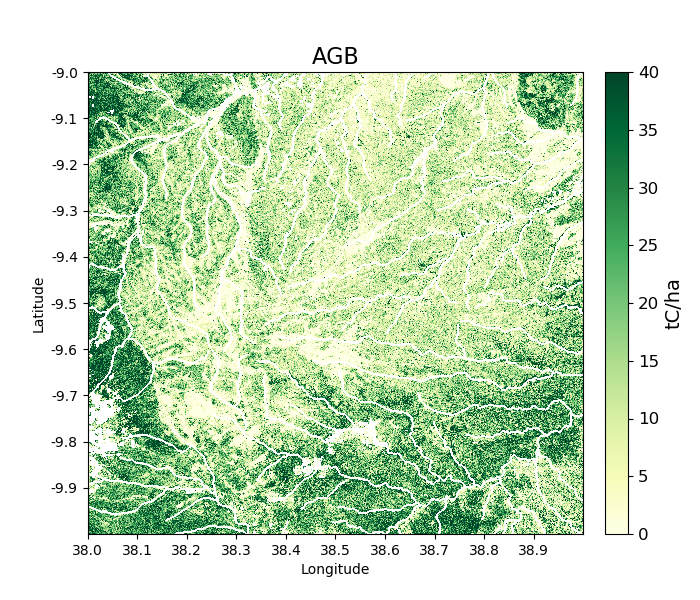
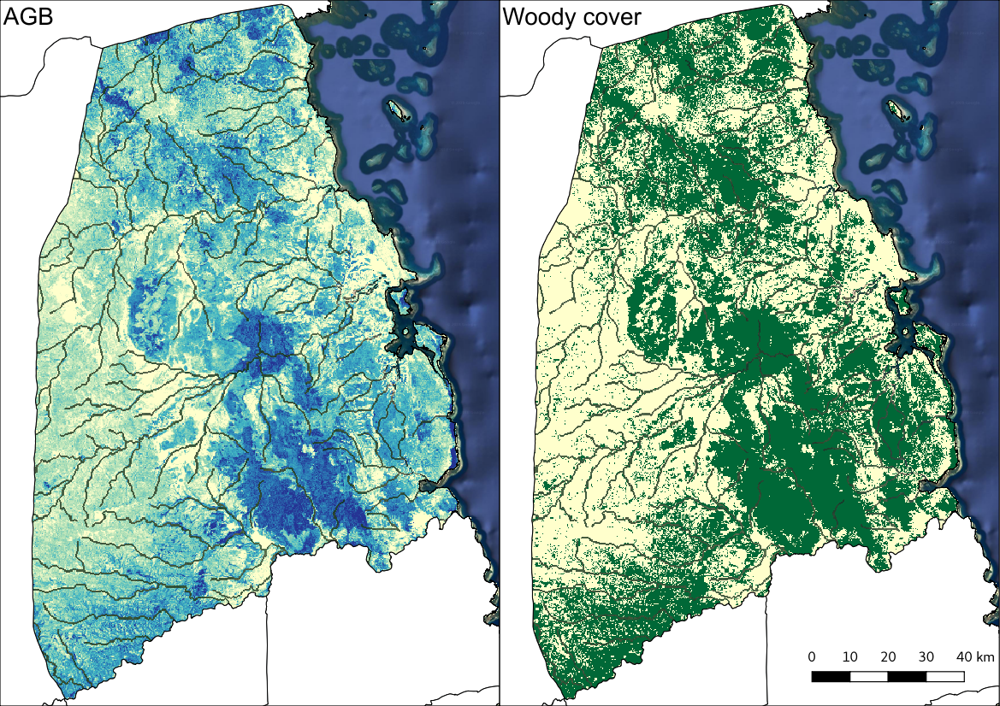

Worked example 2: Your first output
===================================

In this section we'll use ``biota`` to generate maps of gamma0 backscatter, AGB, and forest cover. This example covers the 3 forms of `biota`.

Open Python and import biota
----------------------------

Open a terminal window (right-click the Desktop, and select 'Open Terminal'), and run the command ``python`` or ``ipython``. We recommend use of ``ipython`` if available, which has a range of features that make it more user-friendly than standard Python. If successful, you should see something that looks like the following:

.. code-block::

    Python 2.7.12 |Anaconda custom (64-bit)| (default, Jul  2 2016, 17:42:40)
    Type "copyright", "credits" or "license" for more information.

    IPython 5.1.0 -- An enhanced Interactive Python.
    ?         -> Introduction and overview of IPython's features.
    %quickref -> Quick reference.
    help      -> Python's own help system.
    object?   -> Details about 'object', use 'object??' for extra details.

    In [1]:

To load the biota module, type:

.. code-block:: python

    >> import biota

Loading an ALOS tile
--------------------

Data from the ALOS mosaic is provided as a series of 1 x 1 degree tiles. To load a tile in memory, we need to tell ``biota`` what directory the ALOS mosaic data are stored in, and what latitude and longitude we want to load. To save us from writing them out repeatedly, we can store these as variables:

.. code-block:: python

    >>> data_dir = '~/DATA/'
    >>> latitude = -9
    >>> longitude = 38

The biota function to load an ALOS tile can be called with the function ``biota.loadTile()``, which takes inputs of (i) the data directory, (ii) the latitude, (iii) the longitude, and (iv) the year (in this order). Here we'll load in data for 2007 using the three variables we previously defined:

.. code-block:: python

    >>> tile_2007 = biota.LoadTile(data_dir, latitude, longitude, 2007)

The new object called ``tile_2007`` has a range of attributes. These can be accessed as follows:

.. code-block:: python

    >>> tile_2007.year
    2007
    >>> tile_2007.lat
    -9
    >>> tile_2007.lon
    38
    >>> tile_2007.directory
    '~/DATA/S05E035_07_MOS/'
    >>> tile_2007.satellite
    'ALOS-1'
    >>> tile_2007.xSize, tile_2007.ySize # Raster size, in pixels
    (4500, 4500)
    >>> tile_2007.xRes, tile_2007.yRes # Pixel resolution in meters
    (24.401, 24.579)

**Advanced:** The tile also contains projection information for interaction with ``GDAL``:

.. code-block:: python

    >>> tile_2007.extent # Extent in the format minlon, minlat, maxlon, maxlat
    (38.0, -10.0, 39.0, -9.0)
    >>> tile_2007.geo_t # A geo_transform object
    (38.0, 0.00022222222222222223, 0.0, -9.0, 0.0, -0.00022222222222222223)
    >>> tile_2007.proj # Projection wkt
    'GEOGCS["WGS 84",DATUM["WGS_1984",SPHEROID["WGS 84",6378137,298.257223563,AUTHORITY["EPSG","7030"]],AUTHORITY["EPSG","6326"]],PRIMEM["Greenwich",0,AUTHORITY["EPSG","8901"]],UNIT["degree",0.0174532925199433,AUTHORITY["EPSG","9122"]],AUTHORITY["EPSG","4326"]]'

There are a few other options that can be specified when loading an ALOS tile, but we'll return to these in the see the :ref:`furtheroptions` section.

Extracting backscatter information
----------------------------------

The ``biota`` module is programmed to calibrate ALOS mosaic data to interpretable units of backscatter. This is performed with the ``getGamma0()`` function. The data are returned as a masked ``numpy`` array:

.. code-block:: python

    >>> gamma0_2007 = tile_2007.getGamma0()
    >>> gamma0_2007
    masked_array(data =
    [[0.0669537278370757 0.04214984634805357 0.05141784577914017 ...,
    0.029133617952838833 0.024789602664736045 0.040281545637899534]
    [0.031600461516752214 0.04214984634805357 0.05141784577914017 ...,
    0.03435099209051573 0.028222499657083098 0.03354230142969638]
    [0.031600461516752214 0.04050920492690238 0.06216969020533775 ...,
    0.037654602824076254 0.04403078198836734 0.025848435873858728]
    ...,
    [0.0900164548052426 0.0662958895217059 0.07768386584418481 ...,
    0.049509525268380976 0.0346139149132766 0.021227103665645366]
    [0.08548700525257016 0.0888309264753313 0.11198792676214335 ...,
    0.08441404357533155 0.06655132961906884 0.05196509713141002]
    [0.07134665398730806 0.05708835833035639 0.07595717558689226 ...,
    0.021496125937039534 0.027866832136739485 0.0629132766445086]],
                mask =
    [[False False False ..., False False False]
    [False False False ..., False False False]
    [False False False ..., False False False]
    ...,
    [False False False ..., False False False]
    [False False False ..., False False False]
    [False False False ..., False False False]],
        fill_value = 1e+20)

By default the image loaded is 'HV' polarised in 'natural' units. It's also possible to specify options for the polarisation ('HV' *[default]* or 'HH') and the units ('natural' *[default]* or 'decibels') as follows:

.. code-block:: python

    >>> gamma0_HH_2007 = tile_2007.getGamma0(polarisation = 'HH', units = 'decibels')
    >>> gamma0_HV_2007 = tile_2007.getGamma0(polarisation = 'HV', units = 'decibels')

If we want to visualise this data, we can run:

.. code-block:: python

    >>> gamma0_2007 = tile_2007.getGamma0(polarisation = 'HV', units = 'decibels', show = True)

Which produces the following image:

If we want to save this data to a geoTiff, we can run:

.. code-block:: python

    >>> gamma0_2007 = tile_2007.getGamma0(polarisation = 'HV', units = 'decibels', output = True)

This will write a GeoTiff file to the current working directory. This file can be processed and visualised in standard GIS and remote sensing software (e.g. QGIS, GDAL).

To load these tiles and save a raster of backscatter through the command line, run:

.. code-block:: console

    biota snapshot -dir /path/to/data/ -lat -9 -lon 38, -y 2007 -o Gamma0 -lf

To change the default polarisation setting, add the flag ``-pz`` and enter the desired polarisation. For instance, to get 'HH' data:

.. code-block:: console

    biota snapshot -dir /path/to/data/ -lat -9 -lon 38, -y 2007 -o Gamma0 -lf -pz HH

NB; biota does not support data visualisation in the command line, as many users will not have a graphic interface from their terminal. To visualise DATA, load the output raster in GIS software or plot it with Python.

Building a map of AGB
---------------------

In a similar way to loading gamma0 backscatter, we can show maps of AGB.

.. code-block:: python

    >>> agb_2007 = tile_2007.getAGB(show = True)

Areas in darker green show denser forest:

Like the previous function (and most others in the ``biota`` module), we can output a GeoTiff as follows:

.. code-block:: python

    >>> agb_2007 = tile_2007.getAGB(output = True) # To output AGB map to a GeoTiff

Or, from the command line, run:

.. code-block:: console

    biota snapshot -dir /path/to/data/ -lat -9 -lon 38, -y 2007 -o AGB -lf

.. note:: By default ``biota`` uses an equation calibrated for ALOS-1 in miombo woodlands of Southern Africa. It's advisable to have a locally calibrated biomass-backscatter equation to improve predictions.

Building a forest cover map
---------------------------

A forest cover map (or 'woody cover') can be generated as follows:

.. code-block:: python

    >>> woodycover_2007 = tile_2007.getWoodyCover(show = True)

and output:

.. code-block:: python

    >>> woodycover_2007 = tile_2007.getWoodyCover(output = True)

To execute this from the command line, run:

.. code-block:: console

    biota snapshot -dir /path/to/data/ -lat -9 -lon 38, -y 2007 -o WoodyCover -lf

By default ``biota`` will use a generic definition of forest of 10 tC/ha with no minimum area. In the next section we'll discuss how this and other forest definitons can be customised.

Further options when loading an ALOS tile
-----------------------------------------
.. _furtheroptions:

``biota`` supports a range of options for data processing and forest definitions. These options should be specified when loading a tile. These various options can be specified in any combination, but be aware that when analysing change the pre-processing steps for each tile should be identical.

Speckle filtering
~~~~~~~~~~~~~~~~~

Radar data are often very noisy as the result of 'radar speckle', which can be supressed with a speckle filter. The ``biota`` module has an Enhanced Lee speckle filter, which can be applied to the ALOS tile. By default, no filtering is applied. The speckle filter should be specified on loading the tile:

.. code-block:: python

    >>> tile_2007 = biota.LoadTile(data_dir, latitude, longitude, 2007, lee_filter = True)

Filtering results in an AGB map is noticeably less noisy than those from unfiltered ALOS image.

.. code-block:: python

    >>> tile_2007.getAGB(show = True)

In the command line, the flag ``-lf`` deactivates the speckle-filtering (ON by default). To keep the filter on, simply do not type the flag:

.. code-block:: console

    biota snapshot -dir /path/to/data/ -lat -9 -lon 38, -y 2007 -o AGB

Downsampling
~~~~~~~~~~~~

Data volumes can be reduced through downsampling.  This comes at a cost to resolution, but does have the positive effect of reducing speckle noise. By default, no downsampling is appied. For example, to halve the resolution of output images, set the parameter ``downsample_factor`` to 2:

.. code-block:: python

    >>> tile_2007 = biota.LoadTile(data_dir, latitude, longitude, 2007, downsample_factor = 2)

With a ``downsample_factor`` of 2, the resolution of the image is halved:

.. code-block:: python

    >>> tile_2007.getAGB(show = True)

In the command line, the flag ``-ds`` activates downsampling and is followed by the downsampling factor. To reproduce the result above, run:

.. code-block:: console

   biota snapshot -dir /path/to/data/ -lat -9 -lon 38, -y 2007 -o AGB -lf

Changing forest definitions
~~~~~~~~~~~~~~~~~~~~~~~~~~~

For many purposes it's useful to classify regions into forest and nonforest areas. To achieve this with ``biota`` a threshold AGB (``forest_threshold``) and a minimum area (``area_threshold``) that separate forest from nonforest can be specified. By default the forest_threshold is 10 tC/ha and the area_threshold is 0 ha. For example, for a forest definition of 15 tC/ha with a minimum area of 1 hecatare:

.. code-block:: python

    >>> tile_2007 = biota.LoadTile(data_dir, latitude, longitude, 2007, forest_threshold = 15, area_threshold = 1)

A higher ``forest_threshold`` or ``minimum_area`` results in a reduced forest area:

.. code-block:: python

    >>> tile_2007.getWoodyCover(show = True)

In the command line, the flag ``-`` activates downsampling and is followed by the downsampling factor. To reproduce the result above, run:

.. code-block:: console

    biota snapshot -dir /path/to/data/ -lat -9 -lon 38, -y 2007 -o WoodyCover -lf -ft 15 -at 1

Changing output directory
~~~~~~~~~~~~~~~~~~~~~~~~~

By default, GeoTiffs are output to the current working directory. This may not be the best place to output GeoTiff files, a different output directory can be specified as follows:

.. code-block:: python

    >>> tile_2007 = biota.LoadTile(data_dir, latitude, longitude, 2007, output_dir = '~/output_data/)

From the command line:
.. code-block:: console

    biota snapshot -dir /path/to/data/ -lat -9 -lon 38, -y 2007 -o WoodyCover -lf -od /path/to/output/

Masking data
------------

The ALOS mosaic product is supplied with a basic mask indicating locations of radar show and large water bodies. For many applications this may not be sufficient. For example, radar backscatter from ALOS is strongly influenced by soil moisture changes, which will be particularly severe around rivers.

For some biomass mapping applications and for change detection, we might want to mask out rivers or other features. The ``biota`` library can generate an updated mask with either classified GeoTiffs or shapefiles.

NB: biota does not support masking from the command line, since it does not output direct visualisations.

Masking with a shapefile
~~~~~~~~~~~~~~~~~~~~~~~~

For this example, we'll use a publically available shapefile of inland water in Tanzania from `Diva GIS`_. Download the shapefile `here`_, unzip it, and save it somewhere accessible.

.. _Diva GIS: http://www.diva-gis.org
.. _here: http://biogeo.ucdavis.edu/data/diva/wat/TZA_wat.zip

This can be done on the command line as follows:

.. code-block:: console

    mkdir auxillary_data
    cd auxillary_data
    wget http://biogeo.ucdavis.edu/data/diva/wat/TZA_wat.zip
    unzip TZA_wat.zip

We can use this shapefile to update the mask in ``biota``, applying a 250 m mask around river lines, as follows:

.. code-block:: python

    >>> tile_2007.updateMask('auxillary_data/TZA_water_lines_dcw.shp', buffer_size = 250)

River lines and 250 m buffer now appear in white in the resultant image:

.. code-block:: python

    >>> tile_2007.getAGB(show = True)

Masking with a GeoTiff
~~~~~~~~~~~~~~~~~~~~~~

Perhaps we aren't interested in mapping known agricultural land, we might want to mask out areas of agriculture from a land cover map.

Here we'll use the `ESA CCI`_ land cover map to locate areas of agriculture. The 2007 map is available to download from `ESA`_.

.. _ESA CCI: https://www.esa-landcover-cci.org/
.. _ESA: ftp://geo10.elie.ucl.ac.be/v207/ESACCI-LC-L4-LCCS-Map-300m-P1Y-2007-v2.0.7.tif

With the command line:

.. code-block:: console

    cd auxillary_data
    wget ftp://geo10.elie.ucl.ac.be/v207/ESACCI-LC-L4-LCCS-Map-300m-P1Y-2007-v2.0.7.tif

In the ESA CCI data product the values ``10``, ``20``, ``30``, and ``40`` correspond to locations with agriculture. We can mask out this class in ``biota`` as follows:

.. code-block:: python

    >>> tile_2007.updateMask('auxillary_data/ESACCI-LC-L4-LCCS-Map-300m-P1Y-2007-v2.0.7.tif', classes = [10, 20, 30])

Areas to the south-west of the image now appear in the white mask.

.. code-block:: python

    >>> tile_2007.getAGB(show = True)

Note, that the ``updateMask()`` function added to the previous water mask rather than replacing it. ``updateMask()`` can be run multiple times to make use of multiple datasets.

Resetting a mask
~~~~~~~~~~~~~~~~

To return the mask to it's original state, run:

.. code-block:: python

    tile_2007.resetMask()

Putting it all together
-----------------------

Using the commands above, we can create a script to automate the pre-processing of an ALOS tile to generate outputs of gamma0 (HV backscatter in units of decibels), AGB and forest cover for the year 2007. We'll filter the data and specify a forest threshold of 15 tC/ha with a minimum area of 1 hectare, Using a text editor:

.. code-block:: python

    # Import the biota module
    import biota

    # Define a variable with the location of ALOS tiles
    data_dir = '~/DATA/'

    # Define and output location
    output_dir = '~/outputs/'

    # Define latitude and longitude
    latitude = -9
    longitude = 38

    # Load the ALOS tile with specified options
    tile_2007 = biota.LoadTile(data_dir, latitude, longitude, 2007, lee_filter = True, forest_threshold = 15., area_threshold = 1, output_dir = output_dir)

    # Add river lines to the mask with a 250 m buffer
    tile_2007.updateMask('auxillary_data/TZA_water_lines_dcw.shp', buffer_size = 250)

    # Calculate gamma0 and output to GeoTiff
    gamma0_2007 = tile_2007.getGamma0(output = True)

    # Calculate AGB and output to GeoTiff
    gamma0_2007 = tile_2007.getAGB(output = True)

    # Calculate Woody cover and output to GeoTiff
    gamma0_2007 = tile_2007.getWoodyCover(output = True)

Save this file (e.g. ``process_2007.py``), and run on the command line:

.. code-block::

    python process_2007.py

**Advanced:** To process multiple tiles, we can use nested ``for`` loops. We can also add a ``try``/``except`` condition to prevent the program from crashing if an ALOS tile can't be loaded (e.g. over the ocean).

.. code-block:: python

    # Import the biota module
    import biota

    # Define a variable with the location of ALOS tiles
    data_dir = '~/DATA/'

    # Define and output location
    output_dir = '~/outputs/'

    for latitude in range(-9,-7):
        for longitude in range(38, 40):

            # Print progress
            print 'Doing latitude: %s, longitude: %s'%(str(latitude), str(longitude))

            # Load the ALOS tile with specified options
            try:
                tile_2007 = biota.LoadTile(data_dir, latitude, longitude, 2007, lee_filter = True, forest_threshold = 15., area_threshold = 1, output_dir = output_dir)

            except:
                continue

            # Add river lines to the mask with a 250 m buffer
            tile_2007.updateMask('auxillary_data/TZA_water_lines_dcw.shp', buffer_size = 250)

            # Calculate gamma0 and output to GeoTiff
            gamma0_2007 = tile_2007.getGamma0(output = True)

            # Calculate AGB and output to GeoTiff
            gamma0_2007 = tile_2007.getAGB(output = True)

            # Calculate Woody cover and output to GeoTiff
            gamma0_2007 = tile_2007.getWoodyCover(output = True)

Visualised in QGIS, the resulting biomass and woody cover maps for Kilwa District are:

Producing an output with the GUI
--------------------------------

once the window is open, select a Latitude and Longitude, then 'Forest property'. Select the year for which you want to donwload and process the data (yes, the download is automatic in the GUI) and tick the boxes you want to output. If you want to refine your analysis, modify the Area threshold and the Biomass threshold. That's it!
