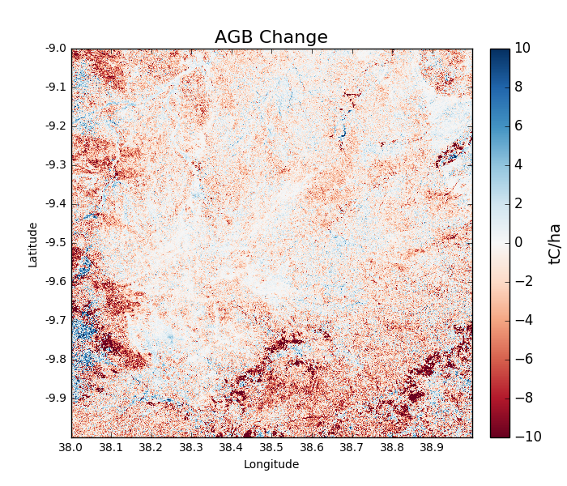
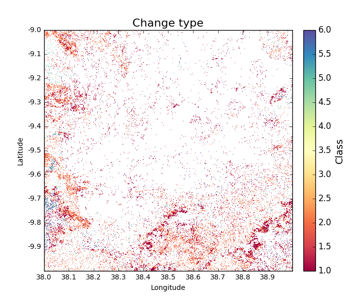
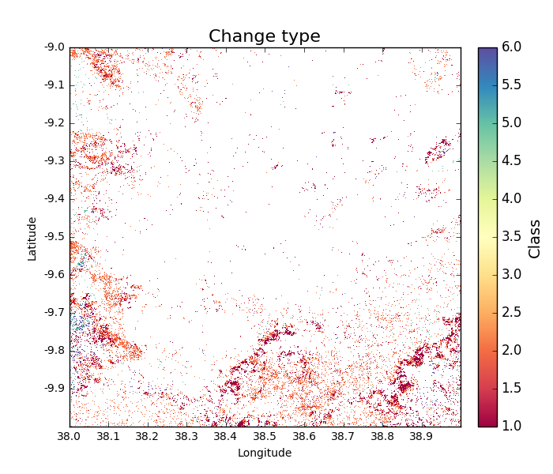
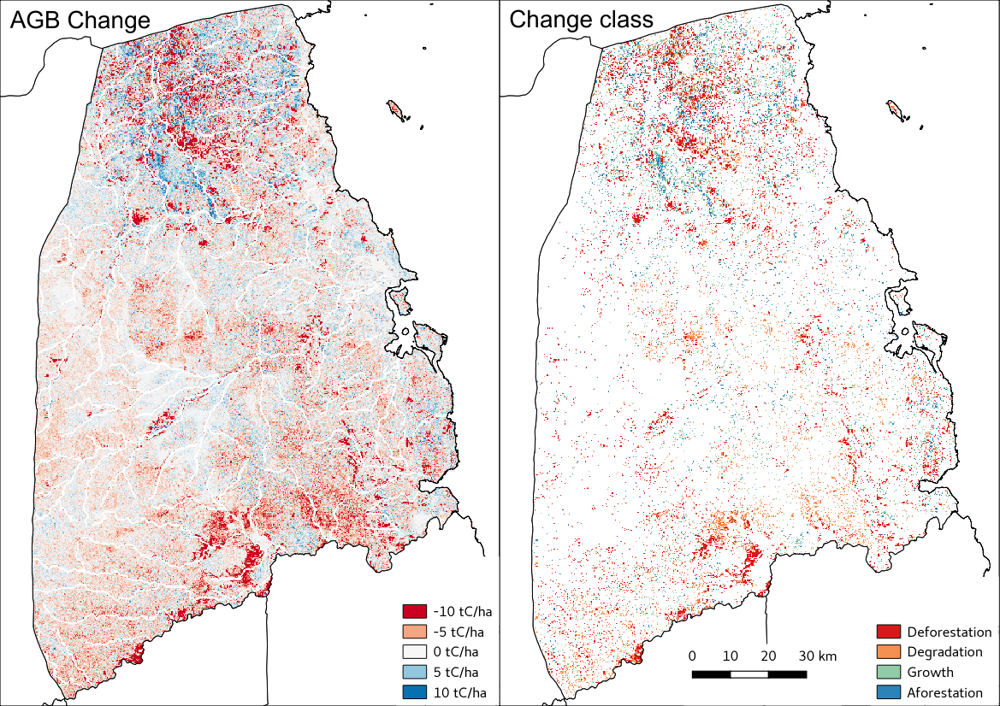

Worked example 3: Generating change maps
========================================

In this section we'll use ``biota`` to generate change maps based on comparisons of AGB estimates.

Loading a pair of ALOS tiles
----------------------------

The first step to making a change map with ``biota`` is to load ALOS tiles from two time steps. Here we'll use the same options specified in the previous section. Note: The two tiles must be for the same location, and when specifying processing options (e.g. filtering, forest thresholds), these will need to be identical for the two tiles.

.. code-block:: python

    # Import the biota module
    import biota

    # Define a variable with the location of ALOS tiles
    data_dir = '~/DATA/'

    # Define and output location
    output_dir = '~/outputs/'

    # Define latitude and longitude
    latitude = -9
    longitude = 38

    # Load the ALOS tile for 2007...
    tile_2007 = biota.LoadTile(data_dir, latitude, longitude, 2007, lee_filter = True, forest_threshold = 15., area_threshold = 1, output_dir = output_dir)

    # ...and for 2010
    tile_2010 = biota.LoadTile(data_dir, latitude, longitude, 2010, lee_filter = True, forest_threshold = 15., area_threshold = 1, output_dir = output_dir)

The two ALOS tiles can be combined into a single object with the following function:

.. code-block:: python

    >>> tile_change = biota.LoadChange(tile_2007, tile_2010)

Calculating AGB Change
----------------------

The change detection approach of ``biota`` uses estimates of AGB to identify where forests are changing. AGB change can be calculated though biota as:

.. code-block:: python

    >>> agb_change = tile_change.getAGBChange()
    >>> agb_change
        masked_array(data =
    [[-3.403055420785666 -3.2185805294699428 -3.842888490812964 ...,
    -5.498752002499962 -6.6389547847411405 -7.520097496689651]
    [-1.5990121702260573 -1.6973552573226378 -2.9678666519388592 ...,
    -4.4864224739504195 -5.864341812148449 -6.796168587735821]
    [-1.02131529023627 -1.5413389977882552 -2.414254618973583 ...,
    -2.830552006729352 -3.8702527731167393 -4.528010392506495]
    ...,
    [0.6013737223757403 2.802579609051506 0.34130080537234875 ...,
    -6.128205502443066 -4.106561725890309 -1.5234573142258547]
    [-1.9193522392770461 2.0279646123649755 0.16270392947076573 ...,
    -8.413927340963976 -5.367616290175992 -2.8658223482473666]
    [-3.794662904080411 -1.1240199233975332 -2.050815071218274 ...,
    -7.369375820470982 -4.486499426633067 -2.4614887987073963]],
                mask =
    [[False False False ..., False False False]
    [False False False ..., False False False]
    [False False False ..., False False False]
    ...,
    [False False False ..., False False False]
    [False False False ..., False False False]
    [False False False ..., False False False]],
        fill_value = 1e+20)

Like with a single tile, ``biota`` can display and output AGB change to GeoTiff:

.. code-block:: python

    >>> agb_change = tile_change.getAGBChange(show = True, output = True)

The predominance of red colours in this tile indicate a general reduction to AGB, with areas of dark red showing locations of deforestation.

To reproduce this result in the command line, run:

.. code-block:: console

    biota change -dir /path/to/data/ -lat -9 -lon 38, -y1 2007 -y2 2010 -o AGB -lf

Classifying change type
-----------------------

Changes in AGB are classified based on a series of thresholds:

+--------------------------------+---------------------------------------------------------------------------+
| **Threshold**                  | **Description**                                                           |
+--------------------------------+---------------------------------------------------------------------------+
| ``forest_threshold``           | The minimum AGB that defines a forest area (tC/ha).                       |
+--------------------------------+---------------------------------------------------------------------------+
| ``change_area_threshold``      | The minimum area over which a change must occurr (ha).                    |
+--------------------------------+---------------------------------------------------------------------------+
| ``change_magnitude_threshold`` | The minimum absolute change of AGB that defines a change event (tC/ha).   |
+--------------------------------+---------------------------------------------------------------------------+
| ``change_intensity_threshold`` | The minimum proportional change of AGB that defines a change event (0-1). |
+--------------------------------+---------------------------------------------------------------------------+

There are 7 change types described in ``biota``, each of which is defined as a number 0 to 6. Change types are:

+-------------------+-----------------+-------------------------------------------------------------------------------------------------------------------------------------+
| **Change class**  | **Pixel value** | **Description**                                                                                                                     |
+-------------------+-----------------+-------------------------------------------------------------------------------------------------------------------------------------+
| Deforestation     | 1               | A loss of AGB from that crosses the ``forest_threshold``.                                                                           |
+-------------------+-----------------+-------------------------------------------------------------------------------------------------------------------------------------+
| Degradation       | 2               | A loss of AGB in a location above the ``forest_threshold`` in both images.                                                          |
+-------------------+-----------------+-------------------------------------------------------------------------------------------------------------------------------------+
| Minor Loss        | 3               | A loss of AGB that does not cross the ``change_area_threshold``, ``change_magnitude_threshold``, or ``change_intensity_threshold``. |
+-------------------+-----------------+-------------------------------------------------------------------------------------------------------------------------------------+
| Minor Gain        | 4               | A gain of AGB that does not cross the ``change_area_threshold``, ``change_magnitude_threshold``, or ``change_intensity_threshold``. |
+-------------------+-----------------+-------------------------------------------------------------------------------------------------------------------------------------+
| Growth            | 5               | A gain of AGB in a location above the ``forest_threshold`` in both images.                                                          |
+-------------------+-----------------+-------------------------------------------------------------------------------------------------------------------------------------+
| Aforestation      | 6               | A gain of AGB that crosses the ``forest_threshold``.                                                                                |
+-------------------+-----------------+-------------------------------------------------------------------------------------------------------------------------------------+
| Nonforest         | 0               | Below ``forest_threshold`` in both images.                                                                                          |
+-------------------+-----------------+-------------------------------------------------------------------------------------------------------------------------------------+

To classify each pixel by its change type, use the function getChangeType():
.. code-block:: python

    >>> change_types = tile_change.getChangeType(show = True)

To reproduce this result in the command line, run:

.. code-block:: console

   biota change -dir /path/to/data/ -lat -9 -lon 38, -y1 2007 -y2 2010 -o ChangeType -lf

Further options for calculating change
--------------------------------------

Like for a single ALOS tile, ``biota`` offers a range of parameters for detection of change which should be specified when loading the change onbject. It's worth thinking carefully about these parameters, how they fit with a forest definition, and how they might affect the mapped outputs. The options are:

Change area threshold
~~~~~~~~~~~~~~~~~~~~~

Setting this to 1 requires a change to occur over at least 1 hectare for the change to be counted. The default of ``change_area_threshold`` is 0 ha.

.. code-block:: python

    >>> tile_change = biota.LoadChange(tile_2007, tile_2010, change_area_threshold = 1)

To reproduce this result in the command line, run:

.. code-block:: console

   biota change -dir /path/to/data/ -lat -9 -lon 38, -y1 2007 -y2 2010 -o ChangeType -lf -cat 1

Change magnitude threshold
~~~~~~~~~~~~~~~~~~~~~~~~~~

Setting this to 5 requires a change of magntiude at least 5 tC/ha to occur before being counted. The default of ``change_magnitude_threshold`` is 0 tC/ha.

.. code-block:: python

    >>> tile_change = biota.LoadChange(tile_2007, tile_2010, change_magnitude_threshold = 5)

To reproduce this result in the command line, run:

.. code-block:: console

   biota change -dir /path/to/data/ -lat -9 -lon 38, -y1 2007 -y2 2010 -o ChangeType -lf -cmt 5

Change intensity threshold
~~~~~~~~~~~~~~~~~~~~~~~~~~

Setting this to 0.2 requires a change of 20 % or greater of AGB to be classified as deforestation, degradation, growth, or afforestation. The default of ``change_intensity_threshold`` is 0.

.. code-block:: python

    >>> tile_change = biota.LoadChange(tile_2007, tile_2010, change_intensity_threshold = 0.2)

To reproduce this result in the command line, run:

.. code-block:: console

   biota change -dir /path/to/data/ -lat -9 -lon 38, -y1 2007 -y2 2010 -o ChangeType -lf -cit 0.2

Change forest threshold
~~~~~~~~~~~~~~~~~~~~~~~

Changes will also be sensitive to the forest definitions used when loading individual tiles. The ``forest_threshold`` should be itentical in both of the loaded tiles, with stricter forest definitions typically reducing change areas:

Changing output directory
~~~~~~~~~~~~~~~~~~~~~~~~~

The output directory for GeoTiffs can be specified in a similar way to a single ALOS tile:

.. code-block:: python

    >>> tile_change = biota.LoadChange(tile_2007, tile_2010, output_dir = '~/outputs/)

Classifying change type with options
------------------------------------

If we repeat the classification of change type, but this time with a ``change_area_threshold`` (1 hectare) and a ``change_magnitude_threshold`` (5 tC/ha), the mapped change shows significantly reduced noise:

.. code-block:: python

    >>> tile_change = biota.LoadChange(tile_2007, tile_2010, change_area_threshold = 1, change_magnitude_threshold = 5)
    >>> tile_change.getChangeType(show = True)

To reproduce this result in the command line, run:

.. code-block:: console

    biota change -dir /path/to/data/ -lat -9 -lon 38, -y1 2007 -y2 2010 -o ChangeType -lf -cat 1 -cmt 5

Masking data
------------

Masks to the change layer are drawn from the two input tiles. Where either one of the input tiles are masked, the change output will also be masked. This means that masks to water bodies etc. should be applied at the ``LoadTile()`` step.

.. code-block:: python

   tile_2007.updateMask('auxillary_data/TZA_water_lines_dcw.shp', buffer_size = 250)
   tile_change = biota.LoadChange(tile_2007, tile_2010)
   tile_change.getAGBChange(show = True)

Other functionality
-------------------

[To follow]

Putting it all together
-----------------------

.. code-block:: python

    # Import the biota module
    import biota

    # Define a variable with the location of ALOS tiles
    data_dir = '~/DATA/'

    # Define and output location
    output_dir = '~/outputs/'

    # Define latitude and longitude
    latitude = -9
    longitude = 38

    # Load the ALOS tiles with specified options
    tile_2007 = biota.LoadTile(data_dir, latitude, longitude, 2007, lee_filter = True, forest_threshold = 15., area_threshold = 1, output_dir = output_dir)

    tile_2010 = biota.LoadTile(data_dir, latitude, longitude, 2010, lee_filter = True, forest_threshold = 15., area_threshold = 1, output_dir = output_dir)

    # Add river lines to the mask with a 250 m buffer
    tile_2007.updateMask('auxillary_data/TZA_water_lines_dcw.shp', buffer_size = 250)

    # Load change between tiles, with options
    tile_change = biota.LoadChange(tile_2007, tile_2010, change_area_threshold = 1, change_magnitude_threshold = 5)

    # Calculate AGB change and output
    agb_change = tile_change.getAGBChange(output = True)

    # Calculate change type and output
    change_type = tile_change.getChangeType(output = True)

Save this file (e.g. ``process_change.py``), and run on the command line:

.. code-block::

    python process_change.py

**Advanced:** To process multiple tiles, we can use nested ``for`` loops. We can also add a ``try``/``except`` condition to prevent the program from crashing if an ALOS tile can't be loaded (e.g. over the ocean).

.. code-block:: python

    # Import the biota module
    import biota

    # Define a variable with the location of ALOS tiles
    data_dir = '~/DATA/'

    # Define and output location
    output_dir = '~/outputs/'

    for latitude in range(-9,-7):
        for longitude in range(38, 40):

            # Update progress
            print 'Doing latitude: %s, longitude: %s'%(str(latitude), str(longitude))

            # Load the ALOS tile with specified options
            try:
                tile_2007 = biota.LoadTile(data_dir, latitude, longitude, 2007, lee_filter = True, forest_threshold = 15., area_threshold = 1)
                tile_2010 = biota.LoadTile(data_dir, latitude, longitude, 2010, lee_filter = True, forest_threshold = 15., area_threshold = 1)
                tile_change = biota.LoadChange(tile_2007, tile_2010, output_dir = output_dir)

            except:
                continue

            # Add river lines to the mask with a 250 m buffer
            tile_2007.updateMask('auxillary_data/TZA_water_lines_dcw.shp', buffer_size = 250)

            # Load change between tiles, with options
            tile_change = biota.LoadChange(tile_2007, tile_2010, output_dir = output_dir)

            # Calculate AGB change and output
            agb_change = tile_change.getAGBChange(output = True)

            # Calculate change type and output
            change_type = tile_change.getChangeType(output = True)

Visualised in QGIS, the resulting AGB change and change type maps for Kilwa District are:

Producing an output with the GUI
--------------------------------

If you have produced forest properties with worked example 2, this should be no problem: simply tick the Forest change box, select a second year to make comparisons with and select the desired output(s). If you want to refine your analysis, modify any of the secondary parameters. That's it!
